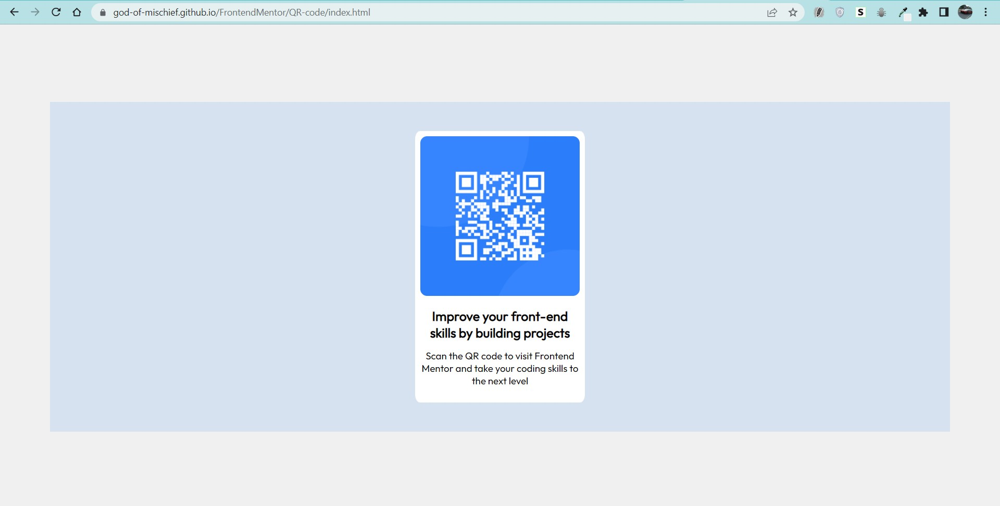

# Frontend Mentor - QR code component solution

This is a solution to the [QR code component challenge on Frontend Mentor](https://www.frontendmentor.io/challenges/qr-code-component-iux_sIO_H). Frontend Mentor challenges help you improve your coding skills by building realistic projects. 

## Table of contents

- [Overview](#overview)
  - [Screenshot](#screenshot)
  - [Links](#links)
- [My process](#my-process)
  - [Built with](#built-with)
- [Author](#author)

## Overview

### Screenshot

### Links

- Solution URL: [QR-code](https://github.com/god-of-mischief/FrontendMentor/tree/main/QR-code)
- Live Site URL: [QR-code-live](https://god-of-mischief.github.io/FrontendMentor/QR-code/index.html)

## My process

### Built with

- Semantic HTML5 markup
- CSS custom properties

## Author

- Website - [Lokesh Namala](https://god-of-mischief.github.io/cv/)
- Frontend Mentor - [@god-of-mischief](https://www.frontendmentor.io/profile/god-of-mischief)
